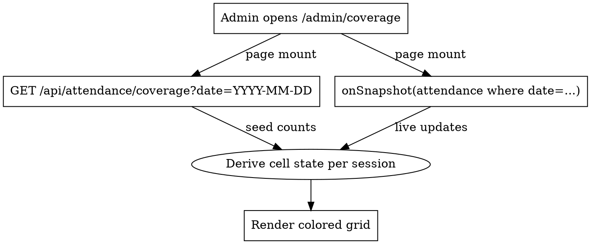

# Admin Attendance Coverage Dashboard — Design

**Date:** 2026-05-22
**Status:** Approved for implementation
**Author:** David Biel + Claude

## Goal

Give the admin a glanceable view of every session in the camp day and whether attendance has been taken — green / grey / red — so they can spot teachers who haven't taken attendance and sessions with absences without scrolling through a long absence list.

Also: remove the Tardy status entirely from the system. Bundled here because the dashboard's color logic depends on the simplified status union.

## Scope

In scope:
- New `/admin/coverage` page (default admin landing).
- New `/admin/faculty-status` page (faculty roll-up).
- New API endpoint for the initial snapshot.
- Tardy removal across types, UI, server, tests, and a one-shot data migration.
- Admin nav update.

Out of scope:
- Teacher-side changes beyond removing the Tardy button.
- Per-student attendance-history views.
- Threshold configuration UI (will be a constant for now; lives in `lib/attendance-rules.ts` for future surfacing).

## Information Architecture

Three admin pages share the day selector and most filters:

- `/admin/coverage` — **new**, default admin landing. Coverage view of all sessions for the selected date.
- `/admin/dashboard` — **existing**, retained as **Absences**. Renamed in nav. Stays the absence-focused live view it is today.
- `/admin/faculty-status` — **new**. Faculty × periods grid for "who hasn't taken attendance".

Admin nav order: **Coverage** · Absences · Faculty Status · Students · Faculty · Sessions · Import · Settings.

## Cell State Machine

One cell on `/admin/coverage` = one session on the selected date. State is derived from `(roster_size, marked_count, absent_count)`:

| Roster coverage | No absences | Has absences |
|---|---|---|
| 0 marked | **grey** "not started" | (impossible) |
| 1 ≤ marked < 80% | **yellow** "in progress · 5/20" | **red** "in progress · 2/20 absent" |
| ≥ 80% marked | **green** "✓ 18/20" | **red** "2/20 absent" |

Rules:
- Red wins over green/yellow whenever any absence exists.
- Threshold of 80% lives in `lib/attendance-rules.ts` as `ATTENDANCE_MOSTLY_TAKEN_THRESHOLD = 0.8`.
- "marked" = student has any attendance doc for `(session_id, date)`. After Tardy removal, status is `'present' | 'absent'`.

The same color rules apply on `/admin/faculty-status` cells, but cells there have less room — show only the icon + a tiny numeric badge.

## Layout

### `/admin/coverage`

- Day selector chip row (reuse existing `<DayChip>` pattern from `/admin/dashboard`).
- Filter bar:
  - **Teacher** — single-select dropdown, options sourced from sessions that exist on the selected date.
  - **Ensemble** — single-select dropdown (existing list).
  - **Period** — horizontal chip row, same component as current dashboard.
  - **Status** — pill filter "All / Not started / In progress / Has absences" (drives client-side filter).
- Body: sessions grouped by period (vertical sections). Within a period, sessions sorted by ensemble then session name. Each session card shows:
  - Status icon (✓ / ◴ / ⚠ / —)
  - Session name (bold)
  - Teacher name · ensemble · instrument (when applicable)
  - `X/Y` badge — coverage count, recolored per state machine
  - Tap target opens the existing `StudentDetailModal` scoped to that session.
- Status icon legend: ✓ green (mostly done, no absences) · ◴ yellow (in progress, no absences) · ⚠ red (has absences, any coverage) · — grey (not started).

### `/admin/faculty-status`

- Day selector chip row.
- Summary chips at top: `caught_up_count / total_active_faculty caught up · X behind`.
  - "Caught up" = all of that faculty's sessions whose `end_time` is in the past are green.
  - "Behind" = at least one past-end-time session is grey, yellow, or red.
  - Sessions whose `start_time` is still in the future don't count toward either bucket.
- Toggle: "show only behind" (hides faculty with no past-end-time sessions and faculty who are caught up).
- Body: table — rows = faculty teaching that day, columns = periods. Each cell:
  - Empty if faculty has no session that period.
  - Otherwise: status icon (✓ green / ◴ yellow / ⚠ red / — grey) + tiny `marked/total` badge, colored per state machine.
  - Cell tap opens `StudentDetailModal` scoped to that session.
- Sort: faculty alphabetical by last name.

## Data Flow



### `GET /api/attendance/coverage?date=YYYY-MM-DD`

**Auth:** admin only (via `withAuth`).

**Returns:**

```ts
type CoverageRow = {
  session_id: string;
  session_name: string;
  period_id: string;
  period_number: number;
  period_name: string;
  start_time: string;
  end_time: string;
  ensemble: string | null;
  instrument: string | null;
  faculty_id: string | null;
  teacher_name: string;
  total_students: number;
  marked_count: number;
  absent_count: number;
};

type CoverageResponse = { rows: CoverageRow[] };
```

**Implementation:** Reuse the `getSessionStudentsFull` join already used by `/api/sessions` for the day; aggregate `marked_count` and `absent_count` server-side. Lives in `lib/firestore.ts` as `getDayCoverage(date)`.

### Live updates

Same Firestore listener pattern as `/admin/dashboard`, but query without the `status` `in` clause — listen to ALL attendance docs for the date. Aggregate by `session_id` client-side. Document count per day ≈ `sessions × roster_size` (typically <2000), well within listener limits.

### State derivation (client)

Pure function in `lib/attendance-rules.ts`:

```ts
type CellState = 'not-started' | 'in-progress' | 'mostly-done' | 'has-absences';

export function deriveCellState(args: {
  total_students: number;
  marked_count: number;
  absent_count: number;
}): CellState;
```

State is recomputed whenever the listener fires.

## Tardy Removal

### Types (`lib/types.ts`)

- `Attendance.status`: `'present' | 'absent' | 'tardy'` → `'present' | 'absent'`.
- `AttendanceDenormalized.status`: same change.
- `FacultySessionRow.tardy_count` → removed.
- `StudentScheduleRow.attendance_status`: drop `'tardy'`.
- `AttendanceReport.status`: drop `'tardy'`.
- `DailyStats.tardy` → removed.

### Server (`lib/firestore.ts`, attendance routes)

- Remove tardy aggregation columns from queries.
- Drop the Tardy validation case from attendance write routes.
- `getAttendanceReport` filters on `status === 'absent'` only.

### UI

- `/admin/dashboard`: remove the Tardy stat button and the Tardy filter option. The page becomes absence-only.
- `/admin/dashboard` CSV export: drop the Tardy rows / status column simplifies to absent-only.
- Teacher UI (`/teacher/...`): remove the Tardy mark button (typically a third option next to Present / Absent).
- Anywhere the string "Tardy" appears in labels, copy, or class names.

### Data migration

One-shot script: `scripts/migrate-remove-tardy.mjs`. For every Firestore doc with `status === 'tardy'`:

- Convert to `status: 'present'` (decision: "tardy" meant the student showed up, so present is more truthful than absent).
- Update `attendance` and (if any exist) denormalized siblings in the same write batch.
- Log a per-doc audit line and a final count.

Run once against `ttuboc-attendance` after the code lands and before reopening admin to staff.

### Tests

- Prune Tardy-specific assertions.
- Add unit coverage for `deriveCellState`.
- Add unit coverage for `getDayCoverage` aggregation (mock Firestore).
- Add a Playwright smoke test for `/admin/coverage` (loads, renders cells, applies a teacher filter).

## Components

New components, each in its own file:

- `app/admin/coverage/page.tsx` — page shell, day/filter state, listener wiring.
- `app/admin/coverage/CoverageGrid.tsx` — period-grouped sections + filter pipeline.
- `app/admin/coverage/SessionCard.tsx` — one session cell, color rules, click handler.
- `app/admin/coverage/CoverageFilters.tsx` — teacher / ensemble / period / status chips.
- `app/admin/faculty-status/page.tsx` — page shell + summary chips + filter.
- `app/admin/faculty-status/FacultyGrid.tsx` — faculty × periods grid.
- `lib/attendance-rules.ts` — `ATTENDANCE_MOSTLY_TAKEN_THRESHOLD`, `deriveCellState`.

## Error Handling

- API errors: page renders empty grid with a retry button (mirrors existing dashboard).
- Listener errors: surfaced as a toast (existing pattern); grid keeps last-known snapshot.
- 0 sessions for the selected day: friendly empty state ("No sessions scheduled for D — try a different day").

## Testing

- Unit: `deriveCellState` exhaustive table test for the 5 combos in the state machine.
- Unit: `getDayCoverage` aggregation correctness with mock Firestore.
- Integration (existing emulator setup): a smoke run that seeds 3 sessions with varied attendance and asserts the API response matches expected state.
- E2E: Playwright — load `/admin/coverage`, apply teacher filter, click a session, see modal.

## Open Items

None — design approved 2026-05-22. Tardy migration target = `'present'`.

## Implementation Order

1. Tardy removal in types + server + tests. Migration script ready, not yet run.
2. `lib/attendance-rules.ts` (`deriveCellState`) + unit tests.
3. `GET /api/attendance/coverage` + `getDayCoverage` in `lib/firestore.ts` + tests.
4. `/admin/coverage` page + components.
5. `/admin/faculty-status` page + components.
6. Nav update.
7. Run migration script against `ttuboc-attendance`.
8. Deploy.
